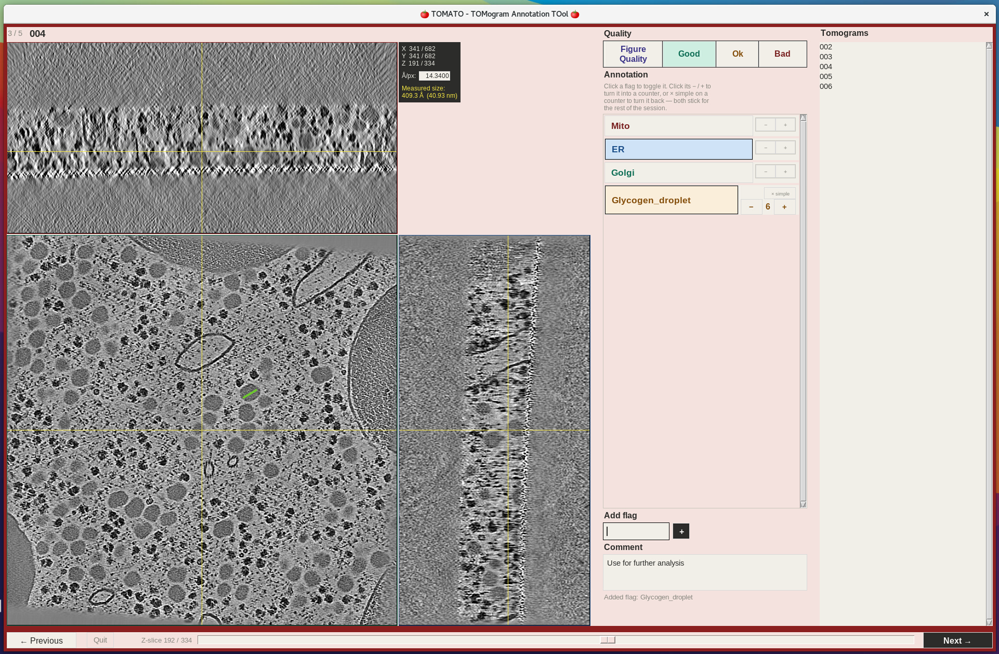

# TOMATO — TOMogram Annotation TOol

[](https://doi.org/10.5281/zenodo.22808238)

TOMATO (TOMogram Annotation TOol) is a lightweight Python GUI that inventories the contents of cryo-ET tomograms, with an in-GUI orthogonal XYZ viewer. It records one row per tomogram — which structures are present, optionally how many of each, an overall quality grade and a free-text comment — so you can work through a few hundred tomograms quickly and end up with a table you can filter and act on. A flag records that a tomogram *contains* mitochondria, not where they are. It loads .mrc files directly into an interactive viewer, autosaves as you go, supports turning any flag into a counter, and can soft-link tomograms matching any annotation for downstream processing. Synced zoom/pan and a drag-to-measure ruler are built in — see section 2.

It has two subcommands:
- `annotate` — open the GUI and annotate a folder of tomograms
- `link` — soft-link tomograms that match a saved annotation (e.g. all "Good" tomograms containing Mito)



---

## License and Copyright

TOMATO is open-source software licensed under the GNU GPLv2 (or later). For full copyright, author attributions, and license details, please refer to the header at the top of the main script file.

---

## 1. Dependencies

TOMATO requires Python 3 with the following packages:

```bash
pip install mrcfile numpy Pillow
```

Tkinter is included with most Python installations. If it is missing:
- **Debian/Ubuntu:** `sudo apt install python3-tk`
- **Fedora:** `sudo dnf install python3-tkinter`
- **macOS (Homebrew):** `brew install python-tk`
- **conda:** `conda install tk`

**EMBL users:** load the following modules instead of using pip
(module versions current as of 2026 — check with `ml avail` if these fail):

```bash
ml mrcfile
ml SciPy-bundle/2025.07-gfbf-2025b
ml Tkinter/3.13.5-GCCcore-14.3.0
ml Pillow/11.3.0-GCCcore-14.3.0
```

---

## 2. Annotating tomograms

### Basic usage

```bash
python TOMATO.py annotate --input /path/to/tomograms
```

This opens the GUI, listing every .mrc file in `--input` that matches the default suffix (`.mrc`), and writes results to `annotations.csv` / `annotations.txt` in the current directory.

### Full argument list

<table>
<tr>
  <th width="160">Argument</th>
  <th>Required</th>
  <th>Default</th>
  <th>Description</th>
</tr>
<tr>
  <td><code>--input</code></td>
  <td>Yes</td>
  <td>—</td>
  <td>Folder containing the tomogram <code>.mrc</code> files to annotate.</td>
</tr>
<tr>
  <td><code>--flags</code></td>
  <td>No</td>
  <td><em>(none)</em></td>
  <td>Extra button labels, added on top of the always-present base set Mito, ER, Golgi. Space-separated, e.g. <code>--flags Lysosome Nucleus Vesicle</code>. You can also add flags live from inside the GUI ("Add flag" box) without restarting.</td>
</tr>
<tr>
  <td><code>--output</code></td>
  <td>No</td>
  <td><code>--previous_csv</code>, else <code>annotations.csv</code></td>
  <td>Where the full annotation table is written. A compact <code>.txt</code> summary is written alongside it automatically, using the same filename stem (e.g. <code>--output myrun.csv</code> → <code>myrun.csv</code> + <code>myrun.txt</code>). When <code>--previous_csv</code> is given and <code>--output</code> is not, annotation continues in that same file.</td>
</tr>
<tr>
  <td><code>--suffix</code></td>
  <td>No</td>
  <td><code>.mrc</code></td>
  <td>Only annotate files <em>ending</em> with this — set it to match your filenames (e.g. <code>_10.00Apx.mrc</code>) to open just that subset. It does not affect what is saved.</td>
</tr>
<tr>
  <td><code>--prefix</code></td>
  <td>No</td>
  <td><em>(none)</em></td>
  <td>Only annotate files <em>starting</em> with this, e.g. <code>--prefix TS_</code>. Combines with <code>--suffix</code> to select <code>&lt;prefix&gt;*&lt;suffix&gt;</code> — useful when one folder holds several sessions or reconstruction types. The pattern used is printed at startup, so you can check it selected what you expected.</td>
</tr>
<tr>
  <td><code>--previous_csv</code></td>
  <td>No</td>
  <td><em>(none)</em></td>
  <td>Continue a specific TOMATO CSV instead of the default one: its flag columns and annotations are loaded, and annotation is <strong>written back to the file specified</strong>. Add <code>--output</code> to write somewhere else and leave the original untouched — useful for branching off someone else's run. Any extra flag columns found in that CSV are added to the flag list, and a flag whose saved values already exceed 1 opens in counter mode.</td>
</tr>
<tr>
  <td><code>--pixel_size</code></td>
  <td>No</td>
  <td><em>(MRC header)</em></td>
  <td>Å/voxel for the ruler tool, overriding the MRC header for every tomogram in the session. By default each tomogram's own header value is used, and shown (editable) in the GUI's Å/px box. Use this when a batch's headers are known to be wrong or were copied incorrectly between programs — a common side-effect of denoising pipelines that don't propagate the original header.</td>
</tr>
</table>

### Auto-resume

If the output file already exists when you start — that is `annotations.csv` unless `--output` says otherwise — and no `--previous_csv` was given, TOMATO loads it and resumes, so you can simply re-run the same command to continue an interrupted session. Any flag columns in that file are added to the flag list, so a flag you added mid-session comes back as a button. `--previous_csv` is the other way to continue a file and takes precedence: when it is given, the output file is not read. CSVs from older versions of TOMATO resume too; TOMATO reports at startup if it had to update any names.

If the file given to `--previous_csv` (or an existing output file) isn't a usable TOMATO CSV file, TOMATO stops before opening the GUI and prints what was wrong and what a correct file looks like, rather than starting blank and overwriting the file you pointed at.

### Example: annotating denoised oocyte tomograms with extra flags

```bash
python TOMATO.py annotate \
    --input /path/to/tomograms \
    --flags Lysosome Vesicle Shell \
    --output oocyte_annotations.csv \
    --suffix _19.12Apx.mrc
```

### Using the GUI

- **Image viewer (left):** the current tomogram in three panels — XY (main, bottom-left), XZ (top-left), YZ (bottom-right) — with a position readout in the remaining corner (X/Y/Z coordinates, the Å/px box, and the last ruler measurement). Click any panel to move the crosshair there. Scroll the wheel over a panel to step through the axis it doesn't show (over XY steps Z, over XZ steps Y, over YZ steps X); the slider in the bottom row also moves Z. The crosshair resets to the volume centre for each new tomogram. Scrolling through Z is smooth once the status line reads "Ready".
- **Annotation (top right):** click a flag button (Mito, ER, Golgi, or any custom flag) to toggle it on/off for the current tomogram. Active flags are highlighted in their assigned colour. The flag list is a fixed-height scrollable column, so adding flags never resizes the rest of the window.
- **Counting flags:** every flag starts as a plain on/off toggle. Each flag button has a small "− +" control in its corner — clicking either half turns that flag into a counter (and applies the first +1/−1), giving a "− N +" stepper with a small "× simple" control above it to turn it back (any existing count then collapses to on/off). This sticks for the rest of the session and applies to every tomogram, not just the current one; flags you never touch stay simple toggles.
- **Add flag:** type a name and press Enter or click "+" to add a button on the fly. It applies to every tomogram in the session. Tomograms you annotated before adding it are recorded as `0` — which reads the same as "checked, not present" — so set your flags up front where you can.
- **Comment:** free-text notes for the current tomogram.
- **Quality:** one row of four — click `FigureQuality`, `Good`, `Ok`, or `Bad` to grade the tomogram. Clicking the same grade again clears it.
- **Tomograms (right list):** click any entry to jump straight to it; the current tomogram is saved first. Names are shortened for readability — whatever the selected filenames all share at the start and end is trimmed, so `TS_20240115_0001_rec.mrc` and its neighbours show as `0001`, `0002`, `0003`. Display only; the CSV records full filenames.
- **Previous / Next:** step through in order. The button reads "Finish ✓" on the last tomogram. Annotations are saved on every navigation, so there is no separate "save" button. Upcoming tomograms load in the background while you annotate, so "Next" is usually instant. On a machine short of memory TOMATO loads fewer ahead, or one at a time, and says so in the status line rather than crashing.
- **Quit:** saves the current tomogram's state and closes the GUI.
- **Window sizing:** the window opens sized to the tomogram it's displaying, not stretched to fill the screen. It can be resized or maximized afterwards and the view grows to fill the extra room, but it won't shrink below its initial size. Resizing resets any zoom back to fit.

Progress is written to disk after every tomogram you move away from, so it's safe to close the window at any point — re-running the same command resumes where you left off.

### Zoom, pan & measuring

#### Zoom and pan

- **Zoom:** hold **Ctrl** and scroll over any panel to zoom about the pointer (a plain wheel still steps through that panel's axis). Zooming shows real detail, not a magnified thumbnail.
- **Pan:** right-click-drag or middle-click-drag on any panel.
- **Synced across all three panels:** XY, XZ and YZ share axes pairwise (XY & XZ both show X, XY & YZ both show Y, XZ & YZ both show Z), so zooming or panning in one panel moves the other two with it. The crosshair stays visible in every panel as you zoom and navigate.
- Zoom resets to fit whenever a new tomogram loads or the window is resized.

#### Measuring

Left-click-drag on any panel to draw a straight ruler line; releasing shows its length in the position corner as **"Measured size:"**, in both Ångström and nanometres. The readout is replaced by your next drag and cleared when a new tomogram loads. A plain click (barely any movement) still just moves the crosshair; only a real drag starts a measurement.

The conversion uses the **Å/px** box in the position corner, which shows what TOMATO currently thinks the pixel size is (normally read straight from the MRC header). It's editable: click in, type a new value, and **press Enter**. Once set by hand it's used for the rest of the session, for every tomogram after. `--pixel_size`, in the argument list above, sets the same value from the command line.

> **Check the Å/px value before trusting a measurement.** If the MRC header has no usable voxel size, TOMATO falls back to `1.0` and the ruler then reports distances in *voxels*.

---


## 3. Soft-linking tomograms by annotation (`link`)

Once you've annotated a batch, use `link` to create a folder of symlinks pointing at tomograms matching one or more conditions (combined with AND logic).

```bash
python TOMATO.py link \
    --csv oocyte_annotations.csv \
    --object Good Mito \
    --input /path/to/tomograms
```

This creates a folder `Good_Mito_tomograms/` containing symlinks to every tomogram graded `Good` and flagged `Mito`.

### Argument list

<table>
<tr>
  <th width="160">Argument</th>
  <th>Required</th>
  <th>Default</th>
  <th>Description</th>
</tr>
<tr>
  <td><code>--csv</code></td>
  <td>Yes</td>
  <td>—</td>
  <td>The TOMATO CSV to read annotations from.</td>
</tr>
<tr>
  <td><code>--object</code></td>
  <td>Yes</td>
  <td>—</td>
  <td>One or more values to filter by, AND-combined. Each is matched against either the <code>quality</code> column (if it's one of <code>FigureQuality</code>, <code>Good</code>, <code>Ok</code>, <code>Bad</code>) or a flag column, where any count greater than 0 counts as a match — so it works the same whether a flag was a plain toggle or a counter. The output folder is named after all values joined with <code>_</code>.</td>
</tr>
<tr>
  <td><code>--input</code></td>
  <td>Yes</td>
  <td>—</td>
  <td>Folder containing the original tomogram <code>.mrc</code> files (the symlink targets).</td>
</tr>
</table>

### More examples

```bash
# All tomograms flagged Mito, regardless of quality
python TOMATO.py link --csv oocyte_annotations.csv --object Mito --input /path/to/reconstruction

# All tomograms rated FigureQuality (for making figures)
python TOMATO.py link --csv oocyte_annotations.csv --object FigureQuality --input /path/to/tomograms

# Good tomograms with both ER and Golgi
python TOMATO.py link --csv oocyte_annotations.csv --object Good ER Golgi --input /path/to/tomograms
```

If a value in `--object` doesn't match any known flag or quality grade, TOMATO prints the available options and exits without creating anything. Existing links in the output folder are replaced, so re-running with the same filters is safe.

---

## 4. Output file formats

**CSV** (`<output>.csv`): one row per tomogram, with columns `tomo_name`, `quality`, one column per flag, and `comment`. `tomo_name` is the tomogram's full filename. Each flag column holds an integer count: `0` if off, `1` for a plain toggle that's on, `2` and above for a counter clicked more than once. This is the canonical record — what `annotate --previous_csv` seeds from and what `link --csv` reads.

```
tomo_name,quality,Mito,ER,Golgi,comment
TS_0001.mrc,Good,1,1,0,nice ribosomes
TS_0002.mrc,Bad,0,0,0,
```

Quality is written as `NA` if never set. Flag columns from an older session or a `--previous_csv` are always kept, even if they aren't in the current flag list, so nothing is silently dropped.

**TXT** (`<output>.txt`): a compact summary, one line per tomogram, listing only the active flags. A flag with a count of exactly 1 shows as its bare name; a flag counted higher shows as `name:N`:

```
TS_0001.mrc,Good,Mito,ER,Shell:3
TS_0002.mrc,Bad
TS_0003.mrc,FigureQuality,Mito,Golgi
```

Useful for quick `grep`/`awk` filtering without parsing the full CSV.

---

## 5. Adapting TOMATO for your own use

TOMATO is a single, self-contained script — there's no reason not to bend it toward your own workflow. Want a different set of default flags, a different colour scheme, an extra quality grade, a keyboard shortcut, or a different output format for some downstream pipeline? All of that lives in one file (`TOMATO.py`) and is meant to be edited.

The script is written to be read by biologists, not only by programmers. It opens with a map of its six numbered SECTIONs, the GUI class carries a map of the eight PARTs it's split into, and the parts most likely to raise a question are explained in plain language where they happen. Searching for `SECTION ` or `PART ` jumps between the major blocks.

If you're not primarily a programmer, or just don't want to spend time hand-editing Tkinter layout code, this is a genuinely good use case for an AI coding assistant like Claude. The code and a (very) large part of this README have been created using Claude.
